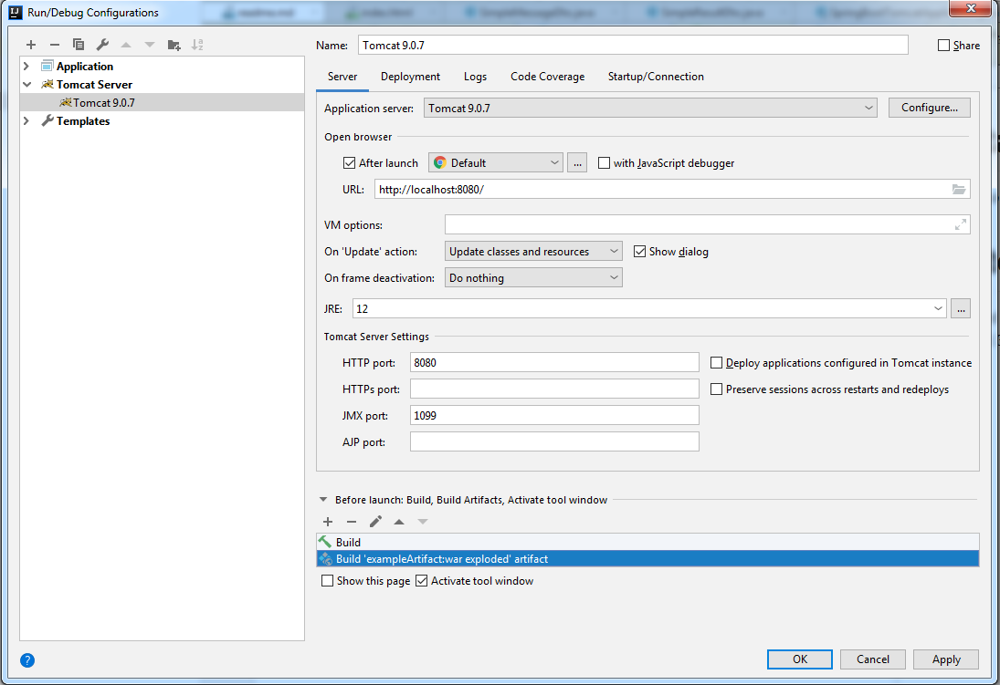
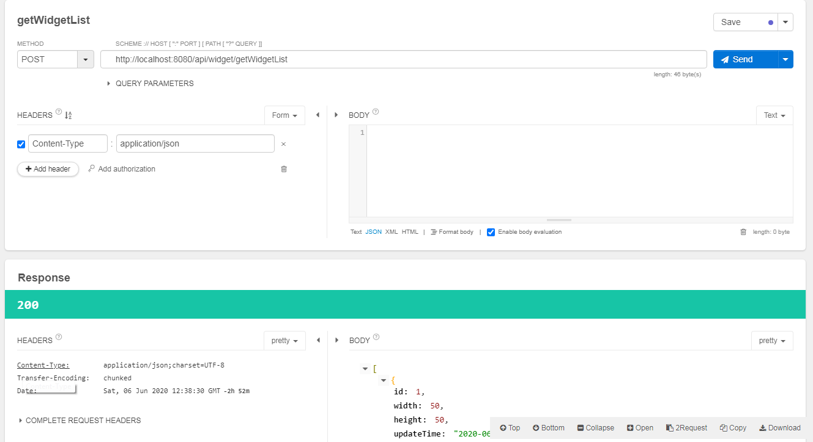

#Test task in Miro

This is task source:
Java task v2.docx

#How to start

1) You need Apache Tomcat 9.0.7 or later
2) Maven 3.3.9 or later. Or Intellij Idea Built in.

run
mvn clean install

​

and startup application

# Available api

#### 1) createWidget
http://localhost:8080/api/widget/createWidget

POST
requestBodyExample: 
{
  "width": 50,
  "height": 50
}

#### 2) getWidgetList

http://localhost:8080/api/widget/getWidgetList
POST

#### 3) getWidgetList

http://localhost:8080/api/widget/updateWidget
POST
requestBodyExample: 
{
  "id": 7,
  "width": 500,
  "height": 500,
  "updateTime": "2020-06-06T16:55:21.6572843",
  "x": 0,
  "y": 0,
  "zIndex": 2
}

#### 4) removeWidget

http://localhost:8080/api/widget/removeWidget
POST
requestBodyExample: 
{"id": 5}

#### 5) getWidgetsCount

http://localhost:8080/api/widget/getWidgetsCount
POST

# In additional

You can use any rest client for send request to server

​

